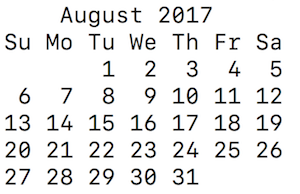

# cal

A Ruby script which emulates the OS X command line utility `cal` for displaying a calendar of the current month.

Run it:

```
$ ruby cal.rb
```

You will get an output like this for the current month:


